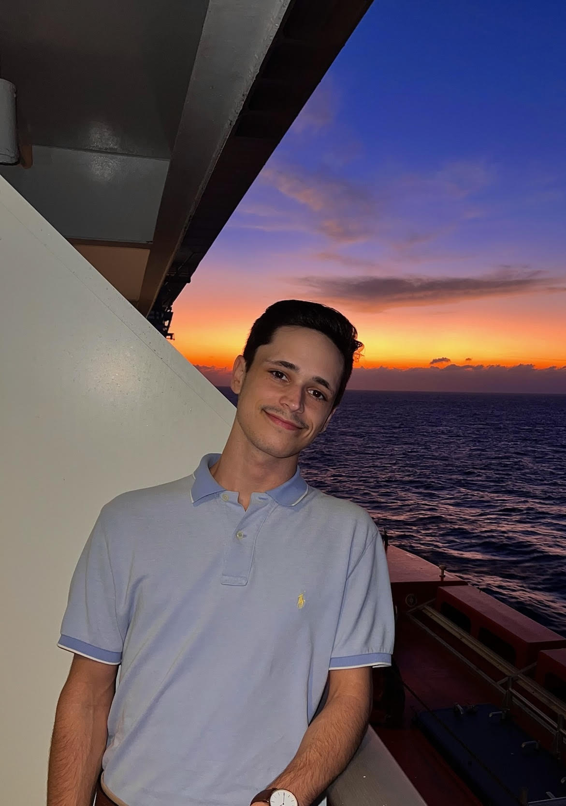

# **Devin Bramlett**

## Resume
Here's a link to my resume.

[//]: # (I got rid of center so that it will be aligned left)
[//]: # (The target="_blank" is to open the link in a new tab)

    

[//]: # (this is to add space)
 

## About Me
Hi! My name is Devin Bramlett, and I am a Computer Science student at Clemson University.

[//]: # (this is to add space)
 

## Projects
Some of my work:

- [Book Recommendation System](recommendation.md)
- [Meal Idea Generator](meal.md)
